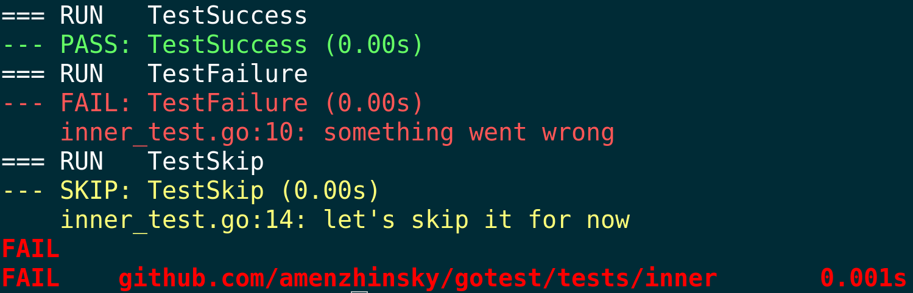

# gotest



Wrapper for `go test` that colorizes output by parsing JSON description of the test execution (`>= go1.0`).

## Installation

Can be done easily with `go get`:

```bash
GO111MODULE=on go get -u github.com/amenzhinsky/gotest
```

## Usage

The program wraps `go test` around and passes all the given arguments to it, just colorizing the output, so you should be familiar with it. 
